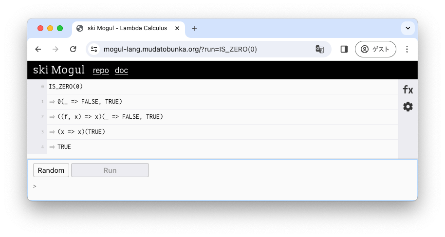

Tuber ではさまざまな関数が定義済みです。
これらの関数は特定のラムダ式と紐付けられています。

例えば `IS_ZERO(0)` という式を評価すると、下記のような結果が得られます。

https://mogul-lang.mudatobunka.org/?run=IS_ZERO(0)



式が簡約され、最終的に `TRUE` という式になりました。
このような評価結果になるのは `IS_ZERO`, `0` がどちらも定義済み関数であるためです。また結果として返っている `TRUE` も定義済み関数です。

### 定義済み関数は上書き, 削除できる

定義済み関数はあらかじめ定義されているだけで、ユーザーによって定義された関数との違いはありません。
そのためユーザーによって定義を上書きしたり、定義を削除することが可能です。

```
IS_ZERO(n) = FALSE  # IS_ZERO の定義を上書きして常に FALSE を返すようにした

TRUE = TRUE  # TRUE の定義を削除した
```

関数を定義する方法, 上書きする方法, 削除する方法については [関数定義: Define](/command/define/) の頁を参照してください。
